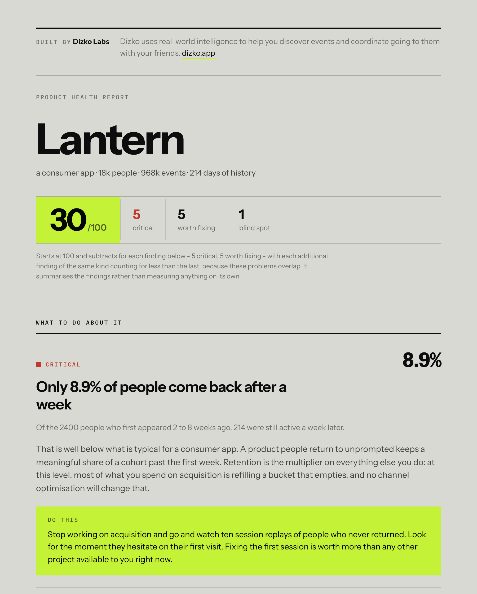

<div align="center">

# 🦔 OpenHog

### Your PostHog is full of data and empty of answers.

**One command reads your project and tells you what to do about it.**

```bash
npx github:ZakKrevitt/OpenHog explain
```

<sub>No repo. No config. No code changes. Just your PostHog key and thirty seconds.</sub>

[](./LICENSE)
[](./package.json)
[](./package.json)
[](./tests)



**Built by [Dizko Labs](https://www.dizko.app).** Dizko uses real-world intelligence to help you
discover events and coordinate going to them with your friends.

</div>

---

## The problem isn't collecting the data

You've been sending events for a year. You have dashboards. You open them, look at some lines going up and to the right, feel vaguely fine, and close the tab.

Nobody ever tells you that your week-1 retention is bad **for your kind of product**. Or that 78% of the people who signed up last month never did the thing your product is for. Or that two of your events silently stopped arriving three weeks ago and four of your charts have been lying since.

**OpenHog reads your PostHog project and tells you what to do about it.**

---

## What you get

```
  Lantern · consumer
  18k people · 968k events · 214 days of history · 11 event types

  30/100 product health
  5 critical · 5 worth fixing · 1 blind spot

  ● CRITICAL
  1. Only 8.9% of people come back after a week

     Of the 2400 people who first appeared 2 to 8 weeks ago, 214 were still
     active a week later.

     That is well below what is typical for a consumer app. A product people
     return to unprompted keeps a meaningful share of a cohort past the first
     week. Retention is the multiplier on everything else you do: at this
     level, most of what you spend on acquisition is refilling a bucket that
     empties, and no channel optimisation will change that.

     → Do this:
       Stop working on acquisition and go and watch ten session replays of
       people who never returned. Look for the moment they hesitate on their
       first visit.

     Week-1 retention           8.9%   (typical: 15% to 45%)
     Week-4 retention           2.2%   (typical: 8% to 30%)
     People who never came back  76%   (typical: under 82%)

  ● CRITICAL
  2. 2 events have stopped arriving

     PostHog saw these regularly between 8 and 30 days ago and hasn't seen
     them at all in the last 7 days: save_toggle, share_click.

     Any number in this report that depends on one of these is currently wrong.
     ...
```

Every finding carries **the number**, **how it compares to typical for your kind of product**, and **one concrete next action**. Not "consider improving onboarding." The specific thing to open tomorrow morning.

---

## Tell it what you're working on

```bash
npx openhog explain --goal retention
```

Every analytics tool reports the same thirty numbers to everybody. A team about to run
out of money and a team making a working product stickier need different things said to
them. One flag changes three things:

- **The goal's own number leads the report**, with its typical range, whether or not
  anything is wrong with it.
- **Findings that bear on it rank first**, tagged `← your goal`. Same project, two
  goals, two different things to do next.
- **Not being able to measure it becomes the top finding.** Say retention is the
  priority and have no way to see it, and that is the most expensive gap you have. It
  is invisible to a tool that never asked.

`acquisition`, `activation`, `retention`, `conversion`, `engagement`, `referral`,
`reliability`. Saved to config once set, so you only say it once.

One thing always outranks it: findings about the measurement itself. A goal measured
with broken instrumentation is not measured, so "two events stopped arriving" stays
above anything you said you cared about.

---

## It works on the events you already have

You don't name your events the way a tool expects. Nobody does.

OpenHog resolves **roles** against whatever your project actually sends, weighted by volume so a leftover experiment event never beats the real one:

```
signup_completed   → account_created       (yours)
activation         → list_created          (yours, used as the core action)
content_opened     → gig_detail_opened     (yours)
error              → error_shown           (yours)
```

Got one wrong? `--role activation=your_event` and every number that used it is corrected.

---

## The shareable report

Every run writes `openhog-report.html`: one file, no network calls, light and dark, prints cleanly. Send it to a cofounder or an investor without explaining anything first.

<div align="center">

</div>

It's built in the [Dizko](https://www.dizko.app) house style: grey canvas, ink black, acid green,
Instrument Sans. Fonts are embedded, so it renders identically offline, in five years, behind any CSP.

---

## What it looks for

**Whether people stay** - week-1 and week-4 retention, whether the curve flattens or collapses, stickiness, power users, and the share of people who showed up once and never returned.

**Where they fall out** - visit to signup, signup to activation, activation to paid, and how long reaching value takes.

**What's going wrong** - how many *people* saw an error (not how many errors fired), and how concentrated your acquisition is.

**Whether you can trust any of it** - events that stopped arriving, properties quietly exploding in cardinality, and the `$pageview`/`$pageleave` divergence that means your SDK is missing the first page load of every session.

**What you can't see at all** - "nothing here looks like an activation event, so you cannot tell where new people are getting stuck." Blind spots are findings too, and usually the most actionable ones.

### Two rules it never breaks

**No claim without a sample.** A metric computed off eleven people is reported as low confidence and never raises a finding. Telling you your retention is bad off a tiny cohort is worse than saying nothing, because it's wrong *and* it teaches you to distrust the rest.

**Never confuses "zero" with "not measured."** If you don't send a signup event, you get "you cannot currently see how many visitors become users," not "your signup rate is 0%."

### About the benchmarks

The "typical" ranges are **rules of thumb**, drawn from widely repeated industry guidance and adjusted per product type. They are **not** measured from a dataset of comparable products, and a healthy product can sit outside any of them. Every finding says which band it used and why, so you can disagree with it in an informed way. They're there because approximately-right context beats a bare number with none.

Better numbers for a vertical are [a very welcome PR](./CONTRIBUTING.md).

---

## Does it work on *your* PostHog?

HogQL is not one language. PostHog Cloud, a fresh self-hosted deployment and a
six-month-old one differ in which functions exist and which syntax parses, so the
query catalogue is executable on its own:

```bash
npx openhog selftest
```

It runs every query OpenHog uses against your project, reports which ones your
deployment can answer, and prints PostHog's actual error for any that fail. Read-only,
needs only `query:read`, writes nothing. If something fails, `--json` output is exactly
what an issue needs.

Every query in this package was verified against a live PostHog Cloud project before
release. That found two bugs a mock never would: an `ARRAY JOIN` that aliased tuple
elements (a hard ClickHouse error), and long-window metrics answering confidently on a
project that had only existed for three days - a 30-day stickiness of 0.25 and a
power-user share of 0%, off a sample of 5,534 people, which would have read as a
critical finding. Metrics now declare how much history they need and are withheld below
it.

---

## Make PostHog itself better, not just your terminal

```bash
npx openhog describe          # preview
npx openhog describe --write  # apply
```

PostHog shows an event's description in the event list, the insight builder and every
picker anybody opens. In a default project every one of them is empty, so each new
person rediscovers what `auth_prompt_action` means by reading the codebase. This fills
them in, from your tracking plan where you have one, from the role the event plays where
you don't, and from its measured behaviour where neither applies. It never invents a
meaning: an event nothing can explain gets its shape described, or is skipped.

It is the only thing OpenHog does that changes what other people see, so it is the most
cautious thing in the package:

- **Previews by default.** Writing takes `--write`, and then asks.
- **Never overwrites a description a human wrote** unless you pass `--overwrite`.
- **The first write verifies itself.** One definition is patched and read back before any
  others are attempted, so a deployment that rejects the call costs one event, not four
  hundred. A 200 that did not persist is caught too.
- **Writes `openhog-describe-rollback.json`** with every previous value before touching
  anything.
- **Idempotent.** Run it twice, the second run does nothing.

Needs `event_definition:write` on your key.

---

## The other half: fixing the instrumentation

If the report says your data can't be trusted, OpenHog fixes that too.

```bash
npx openhog doctor    # why is nothing arriving?
npx openhog init      # read the codebase, instrument it, build the dashboards
npx openhog check     # has the code drifted from the plan? exits 1. good in a hook
npx openhog selftest  # do all my queries run on your deployment?
```

### `openhog doctor`

The "why is my PostHog empty" fixer. Checks CSP directives, env vars, SDK config, project settings, and does a live ingest round-trip that distinguishes "my code is wrong" from "my key is wrong."

It knows the four failures that are green in dev, green in CI, and broken in production:

| | The trap |
|---|---|
| **1** | **CSP directives are separate allowlists.** A host in `connect-src` is *not* thereby loadable as a script. PostHog's asset host serves the replay recorder as a script. Miss it in `script-src` and events flow forever while replay records nothing. |
| **2** | **`capture_pageview: 'history_change'` skips the first page load.** Every direct visit and reload sends `$pageleave` with no `$pageview`. Web Analytics reads near zero. |
| **3** | **Sanitising `$current_url` to a bare path breaks Web Analytics.** It parses that field to attribute a visit to a domain. Strip the ids, keep the origin. |
| **4** | **Replay starts on the first navigation, not on landing.** The SDK is imported dynamically, so land-look-leave sessions are exactly the ones never recorded. |

Full write-up: [docs/TRAPS.md](./docs/TRAPS.md).

### `openhog init`

Reads your codebase, writes a tracking plan, emits a hardened analytics module with all four traps closed, and builds dashboards where **every tile references an event your code actually emits** - verified by static analysis, then validated against your project's query API before it's created.

Six core dashboards plus a pack for your product type, and an `ANALYTICS.md` explaining what every chart means. [docs/DASHBOARDS.md](./docs/DASHBOARDS.md).

---

## For agents

```jsonc
// .mcp.json
{ "mcpServers": { "openhog": { "command": "npx", "args": ["-y", "openhog", "mcp"] } } }
```

`explain_product` gives your agent the ranked findings. `query_analytics` runs HogQL. `get_tracking_plan` lets it match your event vocabulary instead of inventing a synonym. `check_instrumentation_drift` catches what a refactor broke.

There's a **Claude Code plugin** in [`plugin/`](./plugin) too, including a browser-assisted walkthrough for getting the API key (which the agent never reads or stores).

---

## Privacy and trust

- **Nothing leaves your machine** except queries to your own PostHog. No telemetry, ever.
- **Zero runtime dependencies.** `npx openhog` installs in about a second and you can audit the whole thing in an afternoon. A tool that asks for an API key should be that auditable.
- **Your key stays yours.** Stored at `~/.openhog/credentials.json`, mode `0600`, outside the repo, and only ever sent as an `Authorization` header.
- **The generated instrumentation is conservative**: autocapture off, URLs normalised in the browser, `respect_dnt` on, and replay never running on routes that show someone's own data.
- **Ejectable.** Plain code, plain JSON, your dashboards in your project. Delete OpenHog and nothing stops working. It never overwrites an analytics module you already wrote.

---

## Install

```bash
npx github:ZakKrevitt/OpenHog explain
```

Clones, builds and runs: about 8 seconds cold, 2 seconds once npm has cached it.
Nothing to install, nothing published required.

Not on npm yet, so the short form is not live. When it is:

```bash
npx openhog explain       # nothing to install
npm i -D openhog          # or keep it for `check` in a hook
```

**Pointing an agent at it?** Give it this repository URL and the command. Everything an
agent needs is in this README, and there is a Claude Code plugin in [`plugin/`](./plugin)
with a skill that knows the whole workflow, including how to walk a human through
getting the API key without ever seeing the key itself.

Node ≥ 20.11 and git. PostHog Cloud US, Cloud EU, or self-hosted (`--host https://posthog.internal`).

You'll need a personal API key with `project:read`, `insight:write`, `dashboard:write`, `query:read`. `openhog auth` walks you through it: opens the right page, names the scopes, takes the paste without echoing it, and proves it works before saving.

---

## Contributing

The highest-leverage contributions:

1. **A better benchmark for a vertical you know.** The ranges in [`src/insights/benchmarks.ts`](./src/insights/benchmarks.ts) are rules of thumb. If you have real numbers, they should replace mine.
2. **A finding rule.** Spotted a pattern in your own data that would have saved you six months? That's ~30 lines in [`src/insights/findings.ts`](./src/insights/findings.ts).
3. **A dashboard pack** for your vertical. One file. [docs/PACKS.md](./docs/PACKS.md).
4. **A doctor check** for a production-only failure you've hit. [docs/TRAPS.md](./docs/TRAPS.md).

[CONTRIBUTING.md](./CONTRIBUTING.md) · [ROADMAP.md](./ROADMAP.md)

---

## Prior art & thanks

Built from lessons instrumenting a real production app, where all four traps above were found the hard way: in production, weeks after shipping, with the charts confidently drawing the wrong number the whole time.

PostHog is a genuinely good product. This is a third-party tool, not affiliated with PostHog Inc.

---

<div align="center">

**[Dizko Labs](https://www.dizko.app)** builds tools for discovering what's happening around you
and getting there with the people you like. OpenHog came out of instrumenting that.

MIT © [Zak Krevitt](https://github.com/ZakKrevitt)

</div>
